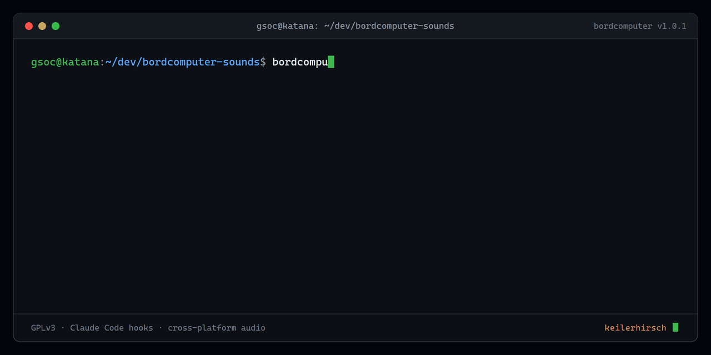

<div align="center">
  <picture>
    <source media="(prefers-color-scheme: dark)" srcset="docs/logo-dark.svg">
    
  </picture>

**Audible Claude Code hook signals for people who do not want to watch the terminal all day.**

[](LICENSE)

</div>

<p align="center"></p>

## What it does

This repository maps selected Claude Code hook events to short sounds so you can tell, without looking at the terminal, when a session finishes work, needs attention, starts, compacts context, or hits one of your own guard conditions.

The default mapping is intentionally opinionated because it comes from a real operator setup. Everything is plain Python and editable file-stem mappings, so it is easier to adapt than to treat as a universal preset.

No third-party Python packages are required.

## Default event map

| Hook event | Meaning | Sound stem |
|---|---|---|
| `Stop` | turn finished | `stop` |
| `Notification` | permission or input needed | `notify` |
| `PreCompact` | context about to compact | `memory` |
| `SessionStart` | session started | `boot` |
| `PreToolUse` (`Skill`) | selected skill categories | mapped by `hook_skill_sound.py` |
| selected memory writes | explicit persistent-memory write | `memory` |

Additional stems such as `redalert`, `denied`, `review`, and `agentshield` are available for custom hooks.

## Install

```bash
git clone https://github.com/KeilerHirsch/claude-bordcomputer-sounds.git
cd claude-bordcomputer-sounds
python download_sounds.py
python play_sound.py stop
```

Then copy the hook blocks you want from [`settings.example.json`](settings.example.json) into `~/.claude/settings.json`, replace the example repository path with your local path, and restart Claude Code so the settings are reloaded.

## Important hook behavior

The example hooks are deliberately synchronous. In the environment this project was built for, detached async hooks lost the interactive audio session even though the subprocess itself completed. The implementation therefore keeps playback short and synchronous.

If your environment behaves differently, treat that as a platform/runtime detail rather than a universal Claude Code property.

## Playback backends

`play_sound.py` selects a platform-native or locally available player:

- **Windows:** MCI through `winmm.dll` via `ctypes`
- **macOS:** `afplay`
- **Linux:** first available of `mpg123`, `ffplay`, `cvlc`, or `paplay`

Playback failures are intentionally non-fatal so a missing player or clip does not break the hook chain. The player also validates sound names before resolving files from `sounds/`.

## Customize it

- Replace any `sounds/<stem>.mp3` with your own clip.
- Edit `SKILL_PATTERNS` in [`hook_skill_sound.py`](hook_skill_sound.py) to map your own skill names.
- Edit `SAVE_TOOLS` in [`hook_mempalace_sound.py`](hook_mempalace_sound.py) for the memory-write tools you actually use.
- Call `play_sound.py redalert` or another stem from your own guard hooks when you need an audible boundary.

The frequent events should stay short and quiet; rare or dangerous events can justify stronger signals. That simple frequency-vs-attention rule is more useful than adding a sound to every tool event.

## Sounds and licensing

- **Code:** GPLv3, see [LICENSE](LICENSE).
- **Sound clips:** not included in this repository. `download_sounds.py` fetches the default Star Trek sound effects from [TrekCore](https://www.trekcore.com/audio/). Those clips remain subject to their respective rights and are intended here for personal/fan use.
- You can skip the downloader entirely and provide your own MP3 files using the expected stem names.

## Related work

This repository is the small audible layer of a broader operator workflow. The more serious notes on model selection, review gates, persistent memory, failure analysis, and upstream fixes live in **[AI Trinity](https://github.com/KeilerHirsch/ai-trinity)**.

## License

GNU GPLv3. Maintained by **KeilerHirsch**.
